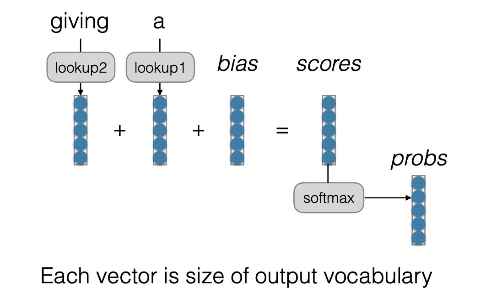
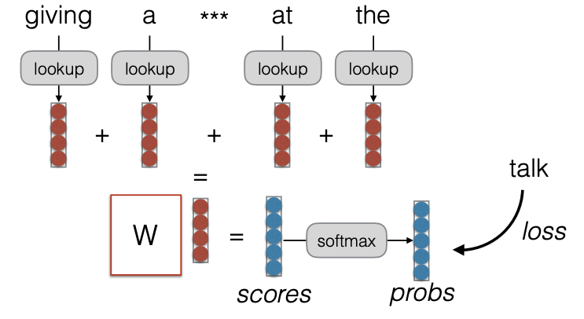
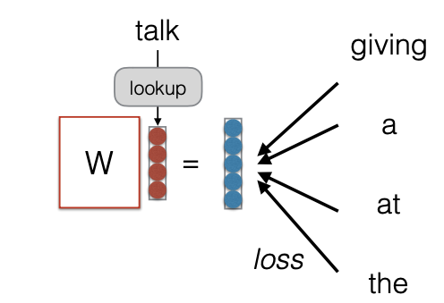
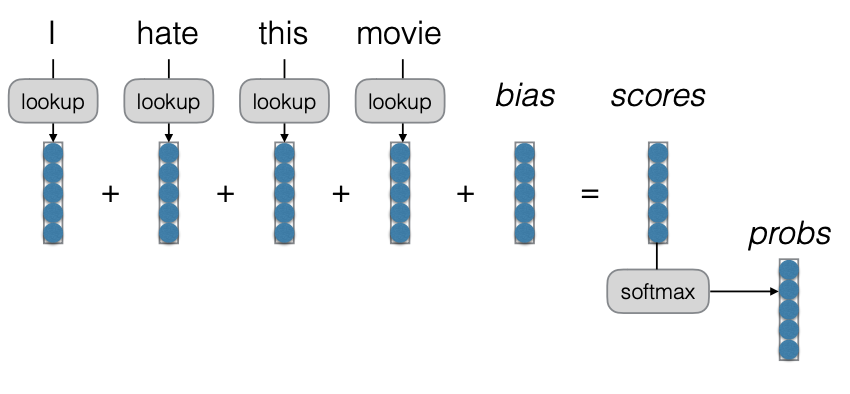
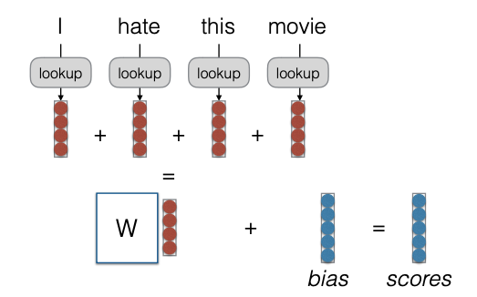
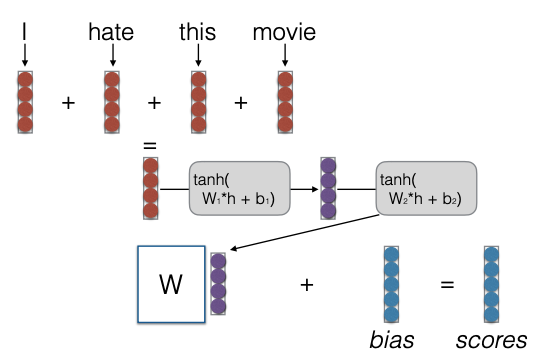

# Neural Networks for NLP
* [Course site](http://www.phontron.com/class/nn4nlp2019/schedule.html)

## Predicting the Next Word
* [Lecture 1](https://github.com/HJSang/ReadingNote/blob/master/NeuralNetworksforNLP/nn4nlp-02-lm.pdf)
* The simple idea is to catch the co-occurrence of individual words using the join probability distribution. The intuition is that the more often the pattern happens, the more likelihood the sentence is OK. In mathematical language, assume the context is  and the next word is . Then, we can calculate the probability of a Sentence  as . The big problem is how to preict ?

* Count-based Language Models:
  * Count up the frequency and divide: .
  * Add smoothing, to deal with zero counts: .
  
* A refresher on Evaluation:
  * Log-likelihood: .
  * Per-word Log-Likelihood: 
  * Per-word (Cross) Entropy: .
  * Perplexity: .

* What can we do w/ LMs?
  * Score sentences: 
  * Generate sentences
* Problems and Solutions?
  * Cannot share strength among similar words. Solution: class based language models.
  * Cannot condition on context with intervening words: Dr. Jane Smith VS Dr. Gertrude Smith. Solution: skip-gram language models
  * Cannot handle long-distance dependencies:
  ```
  for tennis class he wanted to buy his own racquet
  for programming class he wanted to buy his own computer
  ```
  Solution: cache, trigger, topic, syntatic models, etc.

* An alternative: Featurized Log-Linear Models:
  * Calculate features of the context
  * Based on the features, calculate probabilities
  * Optimize feature weights using gradient descent, etc.
  * Example: Previous words: "giving a", predict the next word in {a, the, talk, gift, hat,...}.  represents how likely they are? : how likely are they given the prev word is "a"? : How likely are they given 2nd prev word is "giving"? : Total socre.
  * Convert scores into probabilities by taking the exponent and normalizing (softmax).
  * A computation Graph View 
* A Note: "Lookup":
  * Lookup can be viewed as "grabbing" a single vector from a big matrix of word embeddings. Assume the embedding matrix A: vector size x num.words. Lookup(2) is to find the second column
  * Similarly, can be viewed as multiplying a "one-hot" vector.
  * Former tends to be faster.

* Training a Model:
  * Reminder: totrain, we calculate a "loss function": a measure of how bad our predictions are. and move the parameters to reduce the loss.
  * The most common loss function for probabilistic models is "negative log likelihood". 

* Parameter Update:
  * Back proportion allows us to calculate the derivative of the loss with respect to the parameters: .
  * Simple stochastic gradient descent optimizes parameters according to the following rule: .

* Choosing a Vocabulary 
  * Unkown words: Necessity for UNK words. We don't have all the words in the word in the training data. Larger vocabularies require more memory and computation time.
  * Common ways: Freqeuncy threshold (usually UNK <=1)
  * Rank threshold

* Evaluation and Vocabulary
  * Important: the vocabulary must be same over models you compare.
  * Or more accurately, all models must be able to generate the test set. It is OK if they can generate more than the test set but not less
  * Comparing a character-based model to a word-level model is fair bit not vice-versa.

* Beyond Linear Models
  * Linear models cannot learn feature combinations. We can remember combinations as features using Neural nets.
  * The computing graph is 
  * Where is Strength Shared?
    * The input is the lookup vector from the word embedding. Word embeddings: Similar input words get similar vectors.
    * Similar output words get similar rows in the softmax matrix
    * Similar contexts get similar hidden states.
    * We can share paramters between the input and output embeddings.

* Training Tricks
  * Shuffling the Training Data
    * Stochastic gradient methods update the paramters a little bit at a time. 
    * What if we have the sentence at the end of the training data 500 times?
    * To train correctly, we should randomly shuffle the order at each time step.
  * Optimization Options:
    * SGD with Momentum
    * Adagrad
    * Adam
    * Many Others: Adadelta, RMSProp
  * Early Stopping, Learning rate Decay
    * Neural Nets have tons of paramters: we want to prevent them fromover-fitting
    * We can do this by monitering our performance on held-out developemnt data and stop training when it starts ti get worse.
    * It als sometimes helps to reduce the learning rate and continue training
  * Dropout
    * Dropout: randomly zero-out nodes in the hidden layer with probability p at the training time only
    * Because the number of nodes at training/test is different, scaling is necessary:
      * Standard dropout: scale by p at test time
      * Inverted dropout: scale by 1/(1-p) at the training time
     
* Efficiency Tricks: Mini-batching
  * On modern hardware 10 operations of size 1 is much slower than 1 operation of size 10
  * Minibatching combines together smaller operations into one big one.
  * Minibacthing:


## Models of Words
* [lecture2](http://www.phontron.com/class/nn4nlp2019/assets/slides/nn4nlp-03-wordemb.pdf)
* Word Embeddings: A continuous vector representation of words
* How to train word embeddings:
  * Initialize randomly, train jointly with the task
  * Pre-train on a supervised task and test on another 
  * Pre-train on an unsupervised task 
* Distributional VS. Distributed Representation:
  * Distributional representations
    * Words are similar if they appear in similar contexts. Distribution of words indicative of usage
    * In contrast: non-distributional representations created from lexical resources such as WordNet.
  * Distributed representations:
    * Basically, something is representated by a vector of values, each representing activations
    * In contrast, local representations, where represented by a discrete symbol (one-hot vector)

* Count based Mtheods
  * Create a word-context count matrix
    * Count the number of co-occurrences of word/context, with rows as word, columns as context. 
    * Maybe weght with pointwise mutual information
    * Maybe reduce dimensions using SVD
  * Measure their colseness using cosine similarity.

* Prediction-based Methods
  * Insead, try to predict the words within a neutral.
  * Word embeddings are the byproduct 

* CBOW:
  * Predict word based on sum of surrounding embeddings: 

*Skip-gram:
  * Predict each word in the context given the word: 

* Count-based and Prediction-based Methods:
  * Strong connection between count-based methods and prediction-based methods
  * Skip-gram objective is equivalent to matrix factorizatin with PMI and discount for number of samples k

* GloVe:
  * A matrix factorization approach motivated by ratios of P(word | context) probabilities
  * Nice derivation from start to final loss function that satisfies desiderata
  * Context has a large effect!
  * Small context window: more syntax-based embeddings
  * Large context window: more semantics-based, topical embeddings
  * Context based on syntax: more functional, with words with same inflection grouped.

* Types of Evaluation:
  * Intrinsic vs. Extrinsic
    * Intrinsic: How good is it based on its features?
    * Extrinsic: How useful is it downstream?
  * Qualitative vs. Quantitative
    * Qualitative: Examine the characteristics of examples
    * Quantitative: calculate statistics

* Visualization of Embeddings
  * Reduce high-dimensional embeddings into 2/3D for visualization
  * Non-linear projections group things that are close in high-dimensional space
  * e.g. SNE/t-SNE

* Limitations of Embeddings:
  * Sensitive to superficial differences (dog/dogs)
  * Insensitive to context (financial bank, bank of river)
  * Not necessarily coordinated with knowledge or cross languages
  * Not interpretatble
  * Can encode bias ( encode stereotypical gender roles, racial biases)
  
* Sparse Embeddings:
  * Each dimension ofa word embedding is not intepretable 
  * Solution: add a sparsity constraint to increase the information content of non-zero dimensions for each word


## Convolutional Networks for Text
* [lecture3](http://www.phontron.com/class/nn4nlp2019/assets/slides/nn4nlp-04-cnn.pdf)
* Bag of Words (BOW): 
* Continuous Bag of Words (CBOW): 
* Deep CBOW: 

