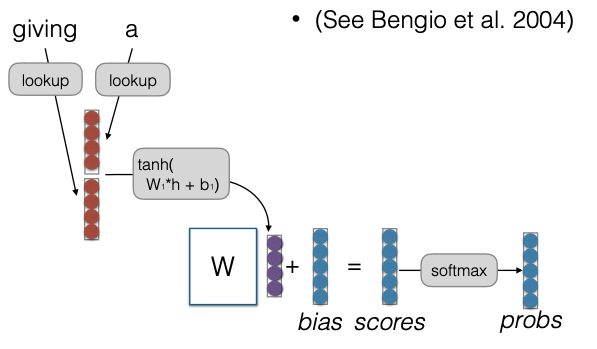
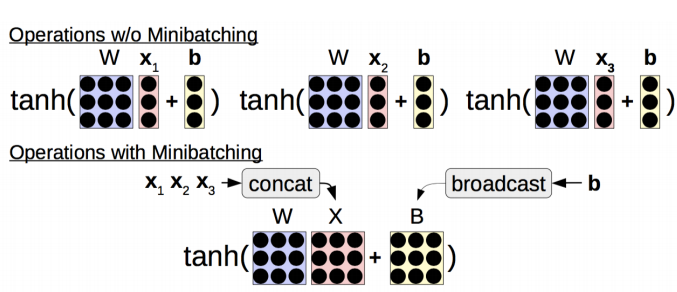
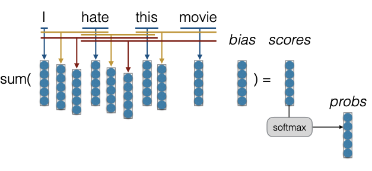
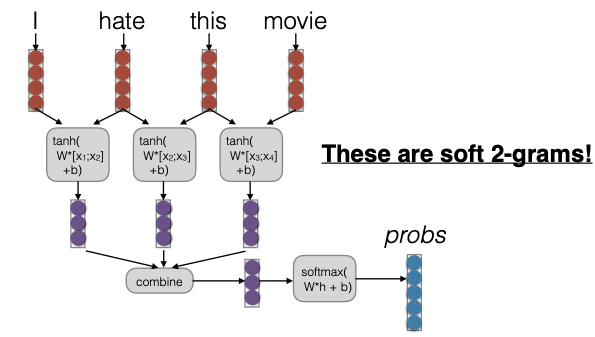

# Neural Networks for NLP
* [Course site](http://www.phontron.com/class/nn4nlp2019/schedule.html)

## Predicting the Next Word
* [Lecture 1](https://github.com/HJSang/ReadingNote/blob/master/NeuralNetworksforNLP/nn4nlp-02-lm.pdf)
* The simple idea is to catch the co-occurrence of individual words using the join probability distribution. The intuition is that the more often the pattern happens, the more likelihood the sentence is OK. In mathematical language, assume the context is  and the next word is . Then, we can calculate the probability of a Sentence  as . The big problem is how to preict ?

* Count-based Language Models:
  * Count up the frequency and divide: .
  * Add smoothing, to deal with zero counts: .
  
* A refresher on Evaluation:
  * Log-likelihood: .
  * Per-word Log-Likelihood: 
  * Per-word (Cross) Entropy: .
  * Perplexity: .

* What can we do w/ LMs?
  * Score sentences: 
  * Generate sentences
* Problems and Solutions?
  * Cannot share strength among similar words. Solution: class based language models.
  * Cannot condition on context with intervening words: Dr. Jane Smith VS Dr. Gertrude Smith. Solution: skip-gram language models
  * Cannot handle long-distance dependencies:
  ```
  for tennis class he wanted to buy his own racquet
  for programming class he wanted to buy his own computer
  ```
  Solution: cache, trigger, topic, syntatic models, etc.

* An alternative: Featurized Log-Linear Models:
  * Calculate features of the context
  * Based on the features, calculate probabilities
  * Optimize feature weights using gradient descent, etc.
  * Example: Previous words: "giving a", predict the next word in {a, the, talk, gift, hat,...}.  represents how likely they are? : how likely are they given the prev word is "a"? : How likely are they given 2nd prev word is "giving"? : Total socre.
  * Convert scores into probabilities by taking the exponent and normalizing (softmax).
  * A computation Graph View 
* A Note: "Lookup":
  * Lookup can be viewed as "grabbing" a single vector from a big matrix of word embeddings. Assume the embedding matrix A: vector size x num.words. Lookup(2) is to find the second column
  * Similarly, can be viewed as multiplying a "one-hot" vector.
  * Former tends to be faster.

* Training a Model:
  * Reminder: totrain, we calculate a "loss function": a measure of how bad our predictions are. and move the parameters to reduce the loss.
  * The most common loss function for probabilistic models is "negative log likelihood". 

* Parameter Update:
  * Back proportion allows us to calculate the derivative of the loss with respect to the parameters: .
  * Simple stochastic gradient descent optimizes parameters according to the following rule: .

* Choosing a Vocabulary 
  * Unkown words: Necessity for UNK words. We don't have all the words in the word in the training data. Larger vocabularies require more memory and computation time.
  * Common ways: Freqeuncy threshold (usually UNK <=1)
  * Rank threshold

* Evaluation and Vocabulary
  * Important: the vocabulary must be same over models you compare.
  * Or more accurately, all models must be able to generate the test set. It is OK if they can generate more than the test set but not less
  * Comparing a character-based model to a word-level model is fair bit not vice-versa.

* Beyond Linear Models
  * Linear models cannot learn feature combinations. We can remember combinations as features using Neural nets.
  * The computing graph is 
  * Where is Strength Shared?
    * The input is the lookup vector from the word embedding. Word embeddings: Similar input words get similar vectors.
    * Similar output words get similar rows in the softmax matrix
    * Similar contexts get similar hidden states.
    * We can share paramters between the input and output embeddings.

* Training Tricks
  * Shuffling the Training Data
    * Stochastic gradient methods update the paramters a little bit at a time. 
    * What if we have the sentence at the end of the training data 500 times?
    * To train correctly, we should randomly shuffle the order at each time step.
  * Optimization Options:
    * SGD with Momentum
    * Adagrad
    * Adam
    * Many Others: Adadelta, RMSProp
  * Early Stopping, Learning rate Decay
    * Neural Nets have tons of paramters: we want to prevent them fromover-fitting
    * We can do this by monitering our performance on held-out developemnt data and stop training when it starts ti get worse.
    * It als sometimes helps to reduce the learning rate and continue training
  * Dropout
    * Dropout: randomly zero-out nodes in the hidden layer with probability p at the training time only
    * Because the number of nodes at training/test is different, scaling is necessary:
      * Standard dropout: scale by p at test time
      * Inverted dropout: scale by 1/(1-p) at the training time
     
* Efficiency Tricks: Mini-batching
  * On modern hardware 10 operations of size 1 is much slower than 1 operation of size 10
  * Minibatching combines together smaller operations into one big one.
  * Minibacthing:


## Models of Words
* [lecture2](http://www.phontron.com/class/nn4nlp2019/assets/slides/nn4nlp-03-wordemb.pdf)
* Word Embeddings: A continuous vector representation of words
* How to train word embeddings:
  * Initialize randomly, train jointly with the task
  * Pre-train on a supervised task and test on another 
  * Pre-train on an unsupervised task 
* Distributional VS. Distributed Representation:
  * Distributional representations
    * Words are similar if they appear in similar contexts. Distribution of words indicative of usage
    * In contrast: non-distributional representations created from lexical resources such as WordNet.
  * Distributed representations:
    * Basically, something is representated by a vector of values, each representing activations
    * In contrast, local representations, where represented by a discrete symbol (one-hot vector)

* Count based Mtheods
  * Create a word-context count matrix
    * Count the number of co-occurrences of word/context, with rows as word, columns as context. 
    * Maybe weght with pointwise mutual information
    * Maybe reduce dimensions using SVD
  * Measure their colseness using cosine similarity.

* Prediction-based Methods
  * Insead, try to predict the words within a neutral.
  * Word embeddings are the byproduct 

* CBOW:
  * Predict word based on sum of surrounding embeddings: 

*Skip-gram:
  * Predict each word in the context given the word: 

* Count-based and Prediction-based Methods:
  * Strong connection between count-based methods and prediction-based methods
  * Skip-gram objective is equivalent to matrix factorizatin with PMI and discount for number of samples k

* GloVe:
  * A matrix factorization approach motivated by ratios of P(word | context) probabilities
  * Nice derivation from start to final loss function that satisfies desiderata
  * Context has a large effect!
  * Small context window: more syntax-based embeddings
  * Large context window: more semantics-based, topical embeddings
  * Context based on syntax: more functional, with words with same inflection grouped.

* Types of Evaluation:
  * Intrinsic vs. Extrinsic
    * Intrinsic: How good is it based on its features?
    * Extrinsic: How useful is it downstream?
  * Qualitative vs. Quantitative
    * Qualitative: Examine the characteristics of examples
    * Quantitative: calculate statistics

* Visualization of Embeddings
  * Reduce high-dimensional embeddings into 2/3D for visualization
  * Non-linear projections group things that are close in high-dimensional space
  * e.g. SNE/t-SNE

* Limitations of Embeddings:
  * Sensitive to superficial differences (dog/dogs)
  * Insensitive to context (financial bank, bank of river)
  * Not necessarily coordinated with knowledge or cross languages
  * Not interpretatble
  * Can encode bias ( encode stereotypical gender roles, racial biases)
  
* Sparse Embeddings:
  * Each dimension ofa word embedding is not intepretable 
  * Solution: add a sparsity constraint to increase the information content of non-zero dimensions for each word


## Convolutional Networks for Text
* [lecture3](http://www.phontron.com/class/nn4nlp2019/assets/slides/nn4nlp-04-cnn.pdf)
* Bag of Words (BOW): use the context (bags of words) to predict next word. Loop up each word in the context and sume them up + bias.Note that, no weight matrix is used. 
We should note that the order of the words do not play a role in BOW.
* Continuous Bag of Words (CBOW): Start from BOW and add weight matrix. 
* Deep CBOW: Deeper than CBOW. Use activation function ``tanh`` to refine the information and repeat multiple times. The advantage is that this complciated network can catch complicated combinations of information (words).

* Note that, the word order information is not used in CBOW, which is important.

* What do our vectors represent?
  * feature combinations
  * capature things such as "not" and "hate"
  * BUT! Cannot handle "not hate"

* Bag of n-grams:
  * Allow us to capture combination features in a simple way "don't love", "not the best"
  * Works pretty well
  * 
  
* What problems with Bag of n-grams?
  * Same as before: paramter explosion
  * No sharing between similar words/n-grams

* 1-d convolutions/time-delay networks: 
  * Sharing the weight matrix and bias across layers and words
  * For 1-d cnn, we use the neighbor words. Concate two vectors together.
  * Like 2-grams 
  * ``tanh(W * [x_i, x_{i+1}] + b)``
  * How to combine outputs from layer1? Pool?
  * Softmax the final output to probability vector, which is # of words in vocabulary.

* CNN for Text
  * Generally based on 1D convolutions
    * But often uses terminology/functions borrowed from image processing for historical reasons
  * Two main paradigms:
    * Context window modeling: For tagging, etc., get the surrounding context before tagging
    * Sentence modeling: Do convolution to extract n-grams, pooling to combine over the whole sentence.

## Architecture of CNN
*[lecture from cs231n](https://cs231n.github.io/convolutional-networks/)
* ConvNet architectures: **Convolutional Layer**, **Pooling Layer**, and **Fully-Connected** Layer (exactly as seen in regular Neural Networks). We will stack these layers to form a full ConvNet architecture.
* Convolutional Layer:
  * First, the depth of the output volume is a hyperparameter: it corresponds to the number of filters we would like to use, each learning to look for something different in the input. 
  * Second, we must specify the stride with which we slide the filter. When the stride is 1 then we move the filters one pixel at a time. When the stride is 2 (or uncommonly 3 or more, though this is rare in practice) then the filters jump 2 pixels at a time as we slide them around. This will produce smaller output volumes spatially.
  * As we will soon see, sometimes it will be convenient to pad the input volume with zeros around the border. The size of this zero-padding is a hyperparameter. The nice feature of zero padding is that it will allow us to control the spatial size of the output volumes (most commonly as we’ll see soon we will use it to exactly preserve the spatial size of the input volume so the input and output width and height are the same).
  * We can compute the spatial size of the output volume as a function of the input volume size ``W``. the receptive field size of the Conv Layer neurons ``F``. The stride with which they are applied ``S`` and and the amount of zero padding used ``P`` on the border. You can convince yourself that the correct formula for calculating how many neurons “fit” is given by ``(W-F+2P)/S +1``. For example for a 7x7 input and a 3x3 filter with stride 1 and pad 0 we would get a 5x5 output. With stride 2 we would get a 3x3 output.
  * Constraints on strides: Note again that the spatial arrangement hyperparameters have mutual constraints. For example, when the input has size W=10, no zero-padding is used P=0, and the filter size is F=3, then it would be impossible to use stride S=2, since (W−F+2P)/S+1=(10−3+0)/2+1=4.5, i.e. not an integer, indicating that the neurons don’t “fit” neatly and symmetrically across the input. Therefore, this setting of the hyperparameters is considered to be invalid, and a ConvNet library could throw an exception or zero pad the rest to make it fit, or crop the input to make it fit, or something. As we will see in the ConvNet architectures section, sizing the ConvNets appropriately so that all the dimensions “work out” can be a real headache, which the use of zero-padding and some design guidelines will significantly alleviate.
  * Parameter Sharing. Parameter sharing scheme is used in Convolutional Layers to control the number of parameter
  * Summary. To summarize, the Conv Layer:
    * Accepts a volume of size ``W1×H1×D1``
    * Requires four hyperparameters:
      * Number of filters ``K``
      * their spatial extent ``F``
      * the stride ``S``
      * the amount of zero padding ``P``.
    * Produces a volume of size ``W2×H2×D2`` where:
      * ``D2=K``
      * ``W2=(W1−F+2P)/S+1``
      * ``H2=(H1−F+2P)/S+1`` (i.e. width and height are computed equally by symmetry)
    * With parameter sharing, it introduces ``F⋅F⋅D1`` weights per filter, for a total of ``(F⋅F⋅D1)⋅K`` weights and ``K`` biases.
    * In the output volume, the d-th depth slice (of size W2×H2) is the result of performing a valid convolution of the d-th filter over the input volume with a stride of S, and then offset by d-th bias.
  * Pooling Layer:
    * The Pooling Layer operates independently on every depth slice of the input and resizes it spatially, using the MAX operation. The most common form is a pooling layer with filters of size 2x2 applied with a stride of 2 downsamples every depth slice in the input by 2 along both width and height, discarding 75% of the activations. Every MAX operation would in this case be taking a max over 4 numbers (little 2x2 region in some depth slice)
    * More generally, the pooling layer:
      * Accepts a volume of size ``W1×H1×D1``
      * Requires two hyperparameters: their spatial extent ``F`` and the stride ``S``.
      * Produces a volume of size ``W2×H2×D2`` where:
        * ``W2=(W1−F)/S+1``
        * ``H2=(H1−F)/S+1``
        * ``D2=D1``
      * Introduces zero parameters since it computes a fixed function of the input
      * For Pooling layers, it is not common to pad the input using zero-padding.
    * Example:  

## Recurrent Neural Netwroks
* [lecture](http://www.phontron.com/class/nn4nlp2019/assets/slides/nn4nlp-05-rnn.pdf)
* NLP and Sequential Data: NLP is full of sequential data
  * Words in sentences
  * Characters in words
  * sentences in discourse
* Long-distance dependencies in Language
* [Recurrent Neural networks cheetsheet](https://stanford.edu/~shervine/teaching/cs-230/cheatsheet-recurrent-neural-networks)
  * Overview:
    - Architecture of a traditional RNNRecurrent neural networks, also known as RNNs, are a class of neural networks that allow previous outputs to be used as inputs while having hidden states. , where ``x`` is input, ``y`` is output, ``a`` is activation and ``t`` is timestep. The transition state from t-1 to t using the computing graph is shown as 
    - Note that the later activation is derived from the previous activation and current input. The output is derived from the activation directly. Please also note that, the parameters ``W_{aa}, W_{a,x}, b_a, W_{ya}, b_y`` are shared across ``t``.
        
|         Advantages                                    |               Drawbacks                                 |
| ----------------------------------------------------- | --------------------------------------------------------|
| Possibility of processing input of any length         | Computation being slow                                  |
| Model size not increasing with size of input          | Difficulty of accessing information from a long time ago|
| Computation takes into account historical information | Cannot consider any future input for the current state  |
| Weights are shared across time                        |                                                         |


