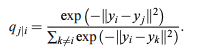
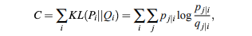

# Reading Notes for t-SNE

* References:
  * [paper](http://www.jmlr.org/papers/volume9/vandermaaten08a/vandermaaten08a.pdf)
  * [How to Use t-SNE Effectively](https://distill.pub/2016/misread-tsne/)

* Abstract: 
  * T-SNE visulizes high-dimensional data by giving each data point a location in two or three-dimensional map.
  * Comparing with Stochastic Neighbor Embedding (SNE), t-SNE: easier to optimize; produces significantly better visualizations by reducing the tendency to crowd points together in the center of the map.
 
* SNE:
  * SNE (Stochastic Neighbor Embedding) starts by converting the high-dimensional Euclidean distance between datapoints into conditional probabilities that represent similarities. The similarity of datapoint $`x_j`$ to datapoint $`x_i`$ is the conditional probabiity $`p_{j|i}`$, that $`x_i`$ would pick ``x_j`` as its neighbor if neighbors were picked in proportion to their probability density under Gaussian centered at ``x_i``.  Mathematically, the conditional probability ``p_{j|i}`` is given by 
 
  * Because we only interested in modeling pairwise similarities, we set ``p_{i|i}=0``

  * For the low-dimensional cunterparts ``y_i`` and ``y_j`` of the highdimensional datapoints ``x_i`` and ``x_j``, it is possible to compare a similar coditional probability, which we denote as ``q_{j|i}``. We set the variance of the Gaussian that employed in the computation of the conditional probabilities ``q_{j|i}`` to 1/sqrt(2). Hence, we model the similarity of map point ``y_j`` to map ``y_i`` by 

  * SNE aims to find a low-dimensional data representation that minimizes the mismatch between ``q_{j|i}`` and ``p_{j|i}``. A nature measure of the faithfulness is the Kullback-Leibler divergence. The cost function ``C`` is given by 

  * Because KL divergence is not symmetric, different types of error in the pairwisedistances in the low-dimensional map are not weighted equally. In particular, there is a large cost for using widely separated map points to represent nearby datapoints. For using a small ``q_{j|i}`` to model a large ``p_{J|i}``, but there is only small cost for using nearby map points to represent widely separated datapoints. In other words, the SNE cost function focuses on retaining the local structure of the data in the map.
  
  * The remainning parameter to be selected is the variance 

